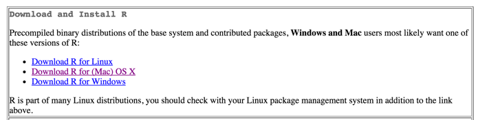
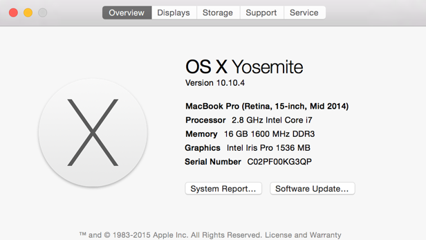
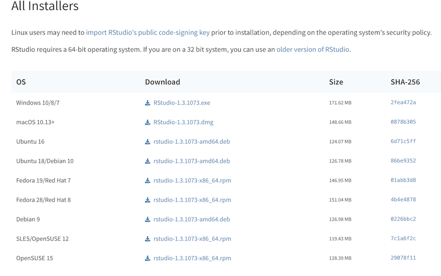
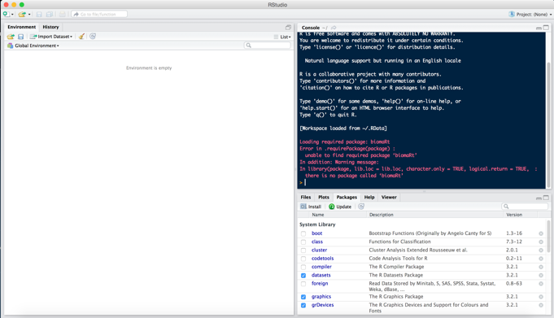

# BIMS 6000 Core Course -- %DATE% - Afternoon Activity

## Introduction to R

The purpose of this activity is to introduce you to data analysis and plotting in RStudio by investigating genome variation. R is open-source and can be used to manipulate, analyze and visualize many types of data. In this activity, we will introduce you to R, go over the basics and then use R to explore genome variation.

## Please do the following prior to the class on %DATE% :

1) Download and install R
2) Download and install RStudio
3) Open 2a_Day4_R_Tutorial.Rmd in RStudio 
4) Install 'tidyverse' package.

Below are the detailed instructions for the above steps.

### 1. Download and install R
  a. Downloads for both Macs and PCs can be found at <https://cran.rstudio.com/>.
  
  b. Make sure you're downloading a **precompiled binary** for **%VERSION%** of R. It will save you the potential pitfalls of compiling. These precompiled binaries are in the box labeled "Download and Install R" at the top of the page. 

  

  c. If you are a **mac user**, go to the apple icon in your toolbar on the top left of your screen, click on "About this mac" and find out which operating system (OS) you are running. Then select which version of R you download accordingly. 

  

  d. If you are running macOS 10.13 (High Sierra) or higher, download %PKGNAME% . For earlier versions, download and install using the appropriate binaries (files with extension .pkg) from the section titled "Binaries for legacy OS X systems".

  e. If you are a **windows user**, click on the "Download R for Windows" link and then click on the "base" subdirectory. This will take you to a subsequent page where you will click "Download R %VERSION% for Windows". This will download both the 32 and 64 bit versions of R. Use the one that matches the native build of your machine. To find out what your native build is, follow the instructions at this link <https://support.microsoft.com/en-us/kb/827218>

  f. To ensure you have the correct binary:

  * If you are a **MAC USER** you should have a .pkg file downloaded.
    
  * If you are a **PC USER** you should have a .exe file downloaded.

  g. Next, go ahead and click/double click on your .pkg or .exe download and follow the instruction on the installer.

### 2. Download and install RStudio

  a. Once you have successfully installed R, we recommend that you install the graphical user interface (GUI; pronounced "gooey") for the R program. GUIs represent some of the tasks you want to complete as clickable buttons, instead of lines of code, which can make using the program easier. We will install RStudio from the link provided below.

  b. Click on <https://www.rstudio.com/products/rstudio/download>, and click on the "Download" button for "RStudio Desktop" on the page.

  c. You will then be taken to a webpage which has links to the various installers. Select the one that is appropriate for your machine. There's only one option for Windows and Mac users, and if you are using Ubuntu or Fedora, select the appropriate version.

  

  d. Again, to check you've downloaded the right program:

  * If you're a **MAC USER** you should have downloaded a .dmg file
    
  * If you're a **PC USER** you should have downloaded a .exe file

  e. Next, go ahead and click/double click on your .pkg or .exe download and follow the instruction on the installer.

  f. Once this installer has finished, locate the RStudio shortcut icon, and click on it. The RStudio short icon looks something like this:

  

  g. Once you've successfully opened RStudio, you should see a screen that looks like this:

  


  h. To ensure the installation process was successful, click the button on the top left of the toolbar that looks like a piece of paper with a green circle and white plus sign on top of it. This will open a new R script. Copy and paste the following line into the script:

```{r}
print("Hello World!")
```

  and then enter that line (command+enter for mac, or ctrl+enter for PC). Your console should echo the statement back to you like this

```{r}
>print("Hello World!")
[1] "Hello World!"
```

  i. Please also have all files on the "UVA Collab" site downloaded and on your computer's desktop at the start of the session.

  j. In RStudio, click on "File" and then "Open File..." and open the `B2a_Day4_R_Tutorial.Rmd` file in RStudio. We'll be working through this document for the tutorial.
  
  k. We'll also need to install some R packages which provide capabilities we will use to analyze data. Specifically, we will be using the package "tidyverse" for analyses. You can install tidyverse by using the following command in the console 

```{r}
install.packages('tidyverse')
```

  l. If you have any problems, help with the installations will be available at the lunch hour on the date the activity is scheduled. The best way to approach having any problem with bioinformatics is to find someone else running the same operating system as you, who has successfully completed the download. They will be well equipped to help you, especially if you are using PC.
