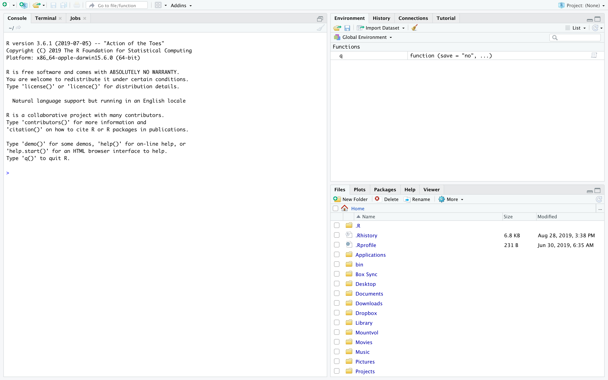

**BIMS 6000 Core Course -- August 29th - Afternoon Activity**

**Introduction to R**

<!--- The following variables will need to be updated every year in this document: DATE, VERSION, LEGACY -->

The purpose of this activity is to introduce you to data analysis and plotting in RStudio by investigating genome variation. R is open-source and can be used to manipulate, analyze and visualize many types of data. In this activity, we will introduce you to R, go over the basics and then use R to explore genome variation.

**Prior to class on $(DATE) please do the following**:

1. Download R

   a. <https://cran.rstudio.com/>

   b. Downloads for both Macs and for PCs can be found at the above link.
   c. Make sure you're downloading a **precompiled binary** for **$(VERSION)** of R. It will save you the potential pitfalls of compiling. These are in the box labeled "Download and Install R" and are at the top of the page.

  

   d. If you are a **mac user**, go to your apple icon in your toolbar on the top left of your screen and find out what operating system (OS) you are running. Then select which version of R you download accordingly.

   

   e. If you are running OS 10.11 or higher, download "R-$(VERSION).pkg", if you are running OS 10.6-10.9, download "R-$(LEGACY).pkg".

   f. If you are a **windows user**, click on the "Download R for Windows" link and then click on the "base" subdirectory. This will take you to a subsequent page where you will click "Download R $(VERSION) for Windows". This will download both the 32 and 64 bit versions of R. Use the one that matches the native build of your machine. To find out what your native build is, follow the instructions at this link <https://support.microsoft.com/en-us/kb/827218>

   g. To ensure you have the correct binary:

    * If you are a **MAC USER** you should have a .pkg file downloaded.
    
    * If you are a **PC USER** you should have a .exe file downloaded.

   h. Next, go ahead and click/double click on your .pkg or .exe download and follow the instruction on the installer.

2. Download R Studio

   a. <https://www.rstudio.com/products/rstudio/download/#download>

   b. Once you have successfully installed R, we recommend that you install the graphical user interface (GUI; pronounced "gooey") for the R program. GUIs represent some of the tasks you want to complete as clickable buttons, instead of lines of code, which can make using the program easier. Our GUI of choice is RStudio, which can be found at the link above.

  

   c. At this link scroll to the bottom of the page to see a list of download links. Select the one that is appropriate for your machine. There's only one option for Windows and Mac users, and if you are using Ubuntu or Fedora, I assume you know what you're doing.

   d. Again, to check you've downloaded the right program:

    * If you're a **MAC USER** you should have downloaded a .dmg file
    
    * If you're a **PC USER** you should have downloaded a .exe file

   e. Next, go ahead and click/double click on your .pkg or .exe download and follow the instruction on the installer.

   f. Once this installer has finished, locate the RStudio shortcut icon, which looks something like this:

   


    What you do not want is to just open R, whose icon looks like this:

   

  g. Once you've successfully opened RStudio, you should see a screen that looks like this:

   

This window is the graphical user interface for the R program, so you're running the R program using the interface of the RStudio Program. The console will tell you which version of R you are running.

   h. To ensure the installation process was successful, click the button on the top left of the toolbar that looks like a piece of paper with a green circle and white plus sign on top of it. This will open a new R script. Copy and paste the following line into the script:

```{r}
print(\"Hello World!\")
```

and then enter that line (command +enter for mac, or ctrl +enter for PC). Your console should echo the statement back to you like this

```{r}
>print(\"Hello World!\")
[1] "Hello World!"
```

   i. Please also have all files on the "UVA Collab" site downloaded and on your computer's desktop at the start of the session.

   j. In RStudio, click on File and then Open File... and open the BIMS\_R\_Tutorial.Rmd file in RStudio. We'll be working through this document for the tutorial.

   k. If you have any problems, help with the installation will be available at the lunch hour on the date the activity is scheduled. The best way to approach having any problem with bioinformatics is to find someone else running the same operating system as you, who has successfully completed the download. They will be well equipped to help you, especially if you are using PC.
